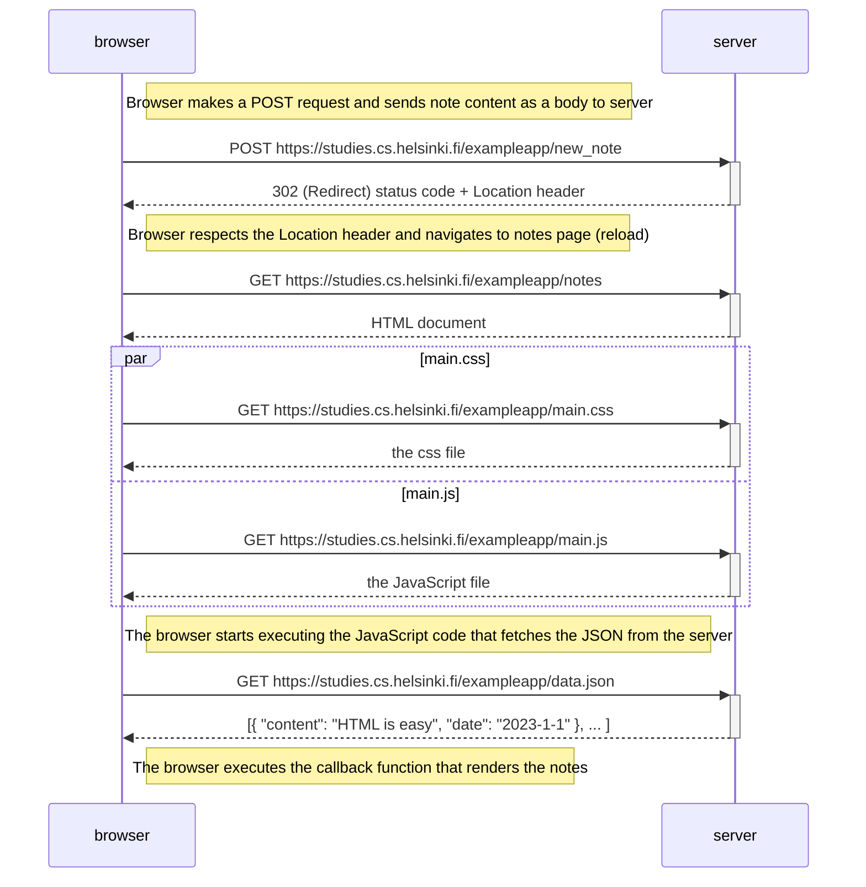

```mermaid
sequenceDiagram
    participant browser
    participant server
    
    Note right of browser: Browser makes a POST request and sends note content as a body to server

    browser->>+server: POST https://studies.cs.helsinki.fi/exampleapp/new_note
    server-->>-browser: 302 (Redirect) status code + Location header

    Note right of browser: Browser respects the Location header and navigates to notes page (reload)

    browser->>+server: GET https://studies.cs.helsinki.fi/exampleapp/notes
    server-->>-browser: HTML document

    par main.css
    browser->>+server: GET https://studies.cs.helsinki.fi/exampleapp/main.css
    server-->>-browser: the css file
    
    and main.js
    
    browser->>+server: GET https://studies.cs.helsinki.fi/exampleapp/main.js
    server-->>-browser: the JavaScript file
    
    end

    Note right of browser: The browser starts executing the JavaScript code that fetches the JSON from the server
    
    browser->>+server: GET https://studies.cs.helsinki.fi/exampleapp/data.json
    server-->>-browser: [{ "content": "HTML is easy", "date": "2023-1-1" }, ... ]

    Note right of browser: The browser executes the callback function that renders the notes 
```