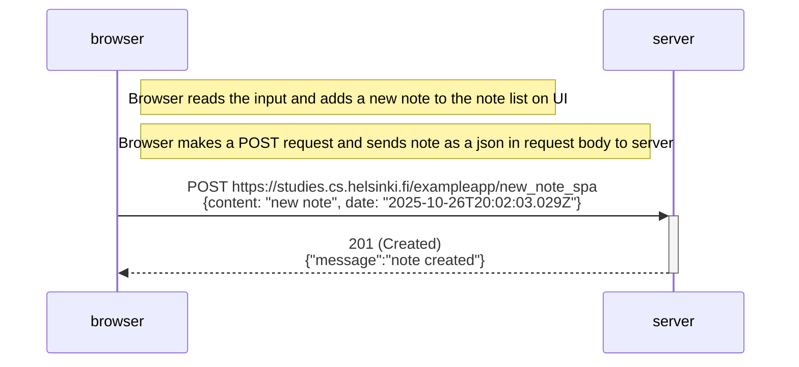

```mermaid
sequenceDiagram
    participant browser
    participant server
    
    Note right of browser: Browser reads the input and adds a new note to the note list on UI

    Note right of browser: Browser makes a POST request and sends note as a json in request body to server

    browser->>+server: POST https://studies.cs.helsinki.fi/exampleapp/new_note_spa<br>{content: "new note", date: "2025-10-26T20:02:03.029Z"}
    
    server-->>-browser: 201 (Created)<br>{"message":"note created"}
```